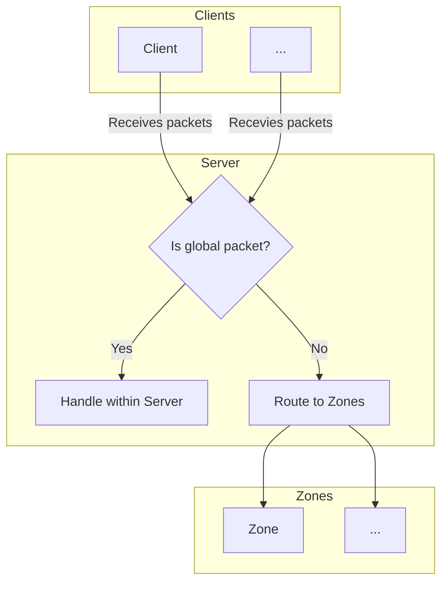

# Tower Main

### Packets Flowchart

```mermaid
flowchart TD
    subgraph Clients
        C1[Client]
        C2[...]
    end

    subgraph Server 
        S{Is global packet?}
        SH[Handle within Server]
        SR[Route to Zones]
    end

    subgraph Zones
        Z1[Zone]
        Z2[...]
    end

    C1 -->|Receives packets| S
    C2 -->|Recevies packets| S

    S -->|Yes| SH
    S -->|No| SR

    SR --> Z1
    SR --> Z2
```